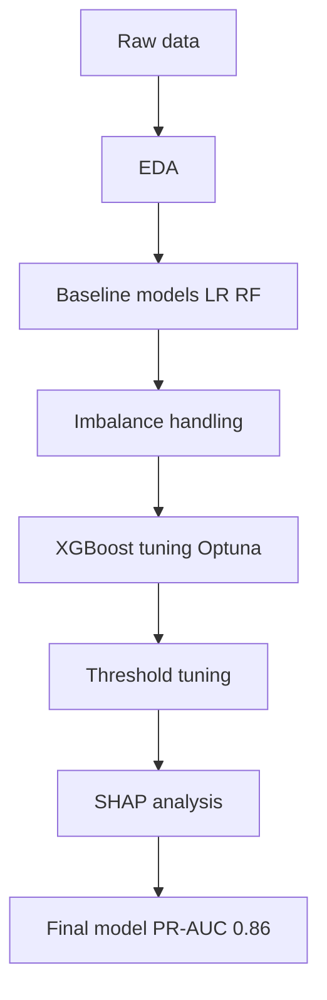

# Credit Card Fraud Detection

ML Pipeline to detect credit card fraud transactions on a heavily imbalanced dataset (0.17% fraud rate). Built with XGBoost, Optuna tuning, and SHAP.

## Problem

Fraudulent transactions cause significant financial losses for banks. The main challenge in fraud detection is the highly imbalanced dataset. Frauds represent only ~0.17% of all transactions, making standard metrics like accuracy misleading.

## Model objectives

- Achieve the highest possible **PR-AUC**
- Balance Precision and Recall to maximize F1
- Maintain reasonably high Recall to catch most frauds, while keeping Precision high to avoid alarm fatigue

## Dataset
- **Source**: [Kaggle - Credit Card Fraud Detection](https://www.kaggle.com/datasets/mlg-ulb/creditcardfraud)
- **Size**: 284,807 rows - credit card transactions, 492 frauds
- **Features**: 30 columns - Amount, Time, V1-V28 (anonymized data for privacy)
- **Target**: Class (0 = legit, 1 = fraud)

## Approach
The project is split into 4 notebooks:
1. **01_eda** - exploratory analysis, identify imbalance, top features, time patterns
2. **02_baseline** - Logistic Regression and Random Forest baselines with 5-fold CV
3. **03_imbalance_handling** - testing imbalance handling methods: class weighting, SMOTE, undersampling on LR (selected class_weight). Then compared RF, XGB, LGBM with the best technique. **Selected: XGBoost** (best PR-AUC and F1).
4. **04_final** - XGBoost tuning with Optuna, threshold tuning, SHAP analysis (global + local)

## Results

**Final model:** XGBoost (Optuna-tuned) with decision threshold 0.96

| Metric | Score |
|--------|-------|
| PR-AUC | 0.8606 |
| Precision | 0.964 |
| Recall | 0.816 |
| F1 | 0.884 |

**On test set (56,962 transactions, 98 frauds):**
- Caught: 80 frauds (82%)
- Missed: 18 frauds (18%)
- False alarms: 3 (out of 56,864 legit transactions)

## Pipeline



## Stack
- **Data**: pandas, numpy
- **ML**: scikit-learn, XGBoost, LightGBM
- **Tuning**: Optuna (Bayesian optimization)
- **Imbalance handling**: SMOTE, undersampling, class weighting
- **Interpretability**: SHAP
- **Visualization**: matplotlib, seaborn


## Usage

> Commands shown for Windows (PowerShell). On Linux/Mac use `source venv/bin/activate` and `unzip`.

```bash
# Setup
python -m venv venv
.\venv\Scripts\Activate.ps1
pip install -r requirements.txt

# Download dataset
kaggle datasets download -d mlg-ulb/creditcardfraud -p data/
Expand-Archive data/creditcardfraud.zip -DestinationPath data/

# Run notebooks
jupyter notebook notebooks/
```